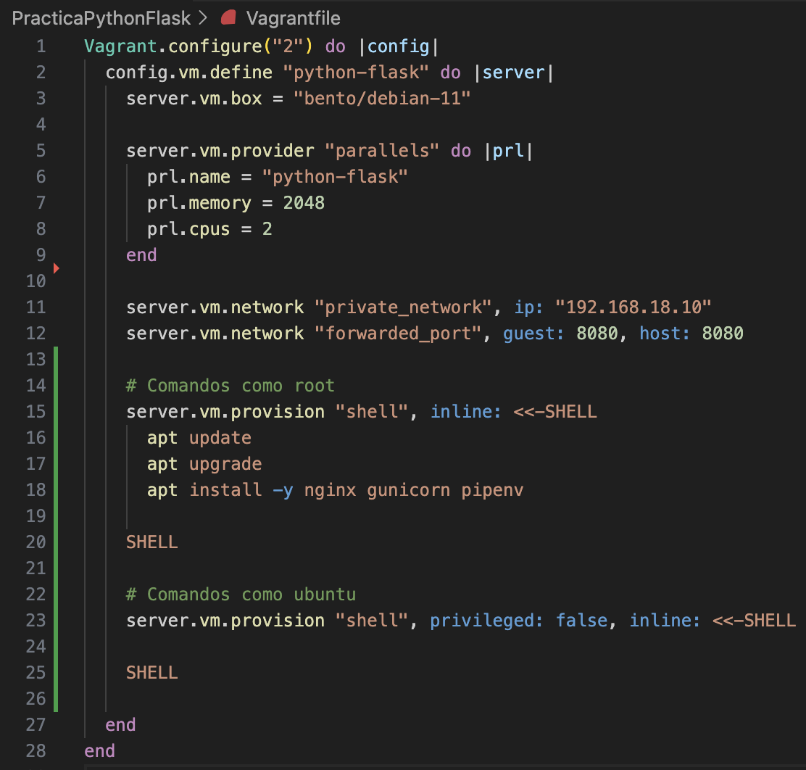

# Documentación Práctica Python con Flash

**Autor:**  Jorge Garre Corrales

Para comenzar la práctica he creado un fichero Vagrantfile en el que he hecho dos bloques de provisión, uno para que ejecute comandos como root y otro para que los ejecute como ubuntu

