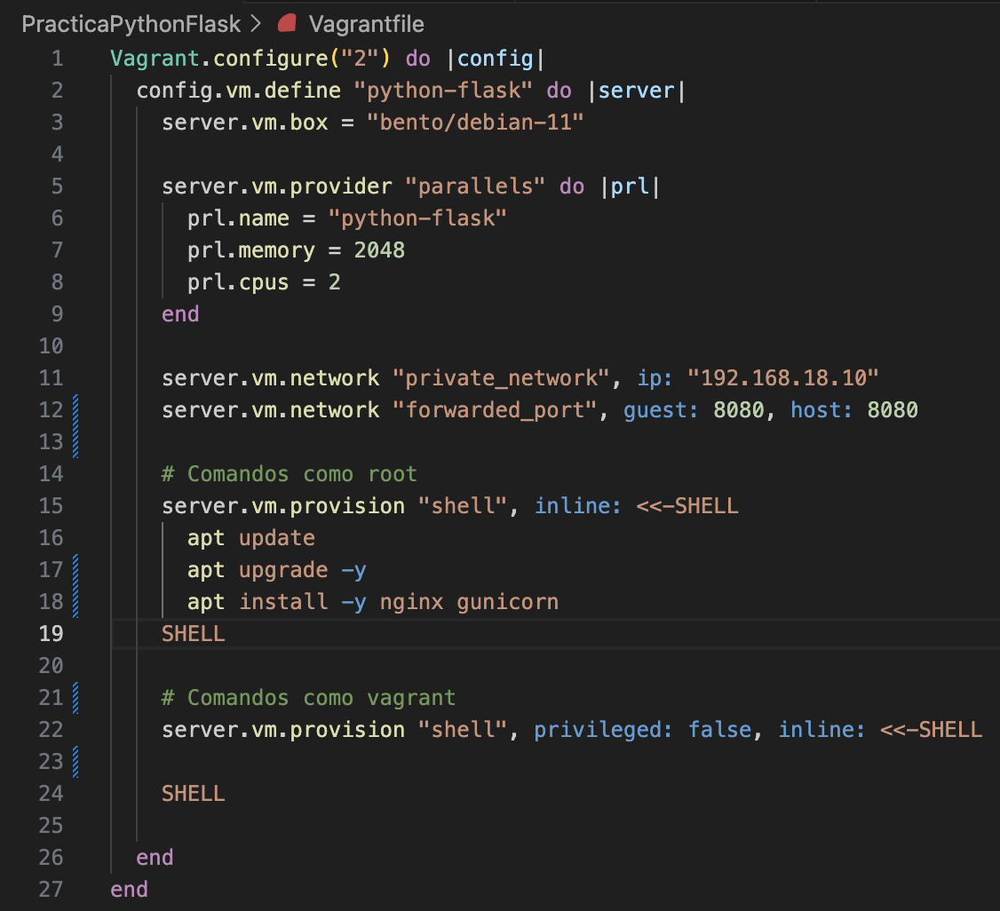
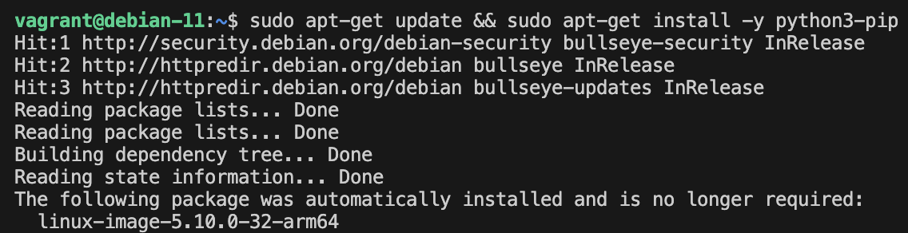
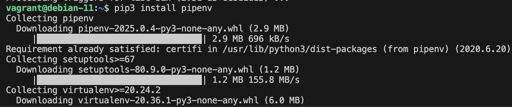
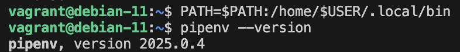
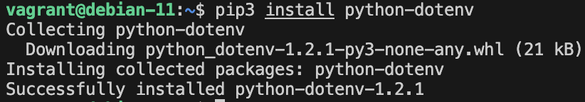
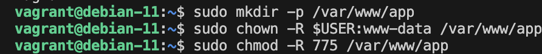
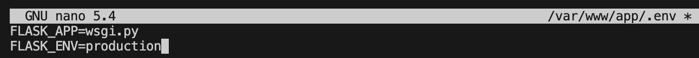
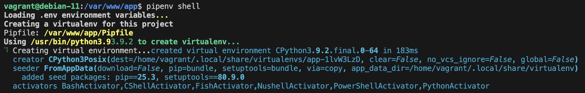
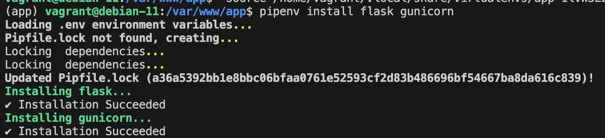
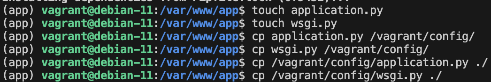

# Documentación Práctica Python con Flash

**Autor:**  Jorge Garre Corrales

Para comenzar la práctica he creado un fichero Vagrantfile en el que he hecho dos bloques de provisión, uno para que ejecute comandos como root y otro para que los ejecute como vagrant

Una vez arrancada la máquina he instaldo el gestor de paquetes pip

Despues he instalado pipenv

Y he comprobado que se ha instalado correctamente

He instalado python-dotenv

He creado el directorio del proyecto y le asignado los permisos

He creado el fichero .env con su contenido

Y lo he copiado en /vagrant/config para poder copiarlo al crear la máquina a través del provisional

He iniciado el entorno virtual

Y he instalado las dependencias para el proyecto

He creado los ficheros de la aplicación, los he copiado a mi ordenador para poder editarlos mas comodamente y luego los he vuelto a copiar dentro de la máquina

