# Documentación Práctica Python con Flash

**Autor:**  Jorge Garre Corrales

## Tarea

Para comenzar la práctica he creado un fichero Vagrantfile en el que he hecho dos bloques de provisión, uno para que ejecute comandos como root y otro para que los ejecute como vagrant

Una vez arrancada la máquina he instaldo el gestor de paquetes pip

Despues he instalado pipenv

Y he comprobado que se ha instalado correctamente

He instalado python-dotenv

He creado el directorio del proyecto y le asignado los permisos

He creado el fichero .env con su contenido

Y lo he copiado en /vagrant/config para poder copiarlo al crear la máquina a través del provisional

He iniciado el entorno virtual

Y he instalado las dependencias para el proyecto

He creado los ficheros de la aplicación, los he copiado a mi ordenador para poder editarlos mas comodamente y luego los he vuelto a copiar dentro de la máquina

Después he lanzado la aplicación

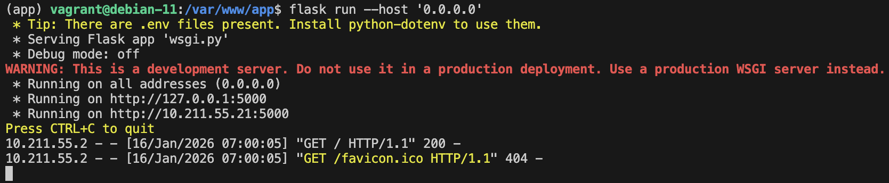

Y he comprobado en el navegador que se ha lanzado correctamente

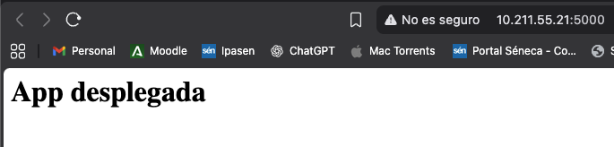

Despues he probado también ha lanzarla con gunicorn

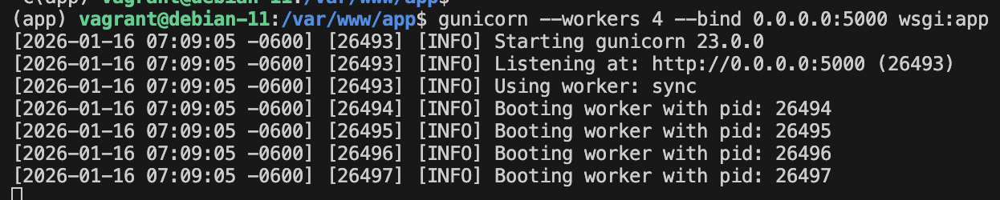

Y he comprobado de la misma forma que funciona

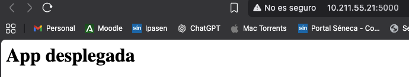

Sacamos la ruta desde donde se ejecuta gunicorn

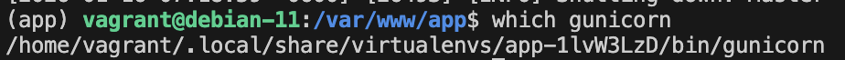

He lanzado y comprobado el que se ha lanzado nginx

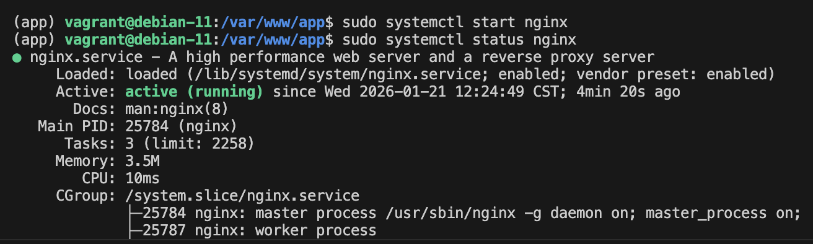

He creado el fichero flask_app.service en mi carpeta /vagrant/config/ y lo he copiado en la máquina Vagrant

Despues he lanzado el servicio que he creado

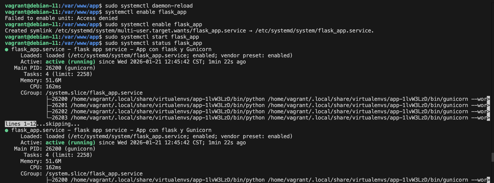

Con nano he creado el fichero app.conf con la siguiente configuración

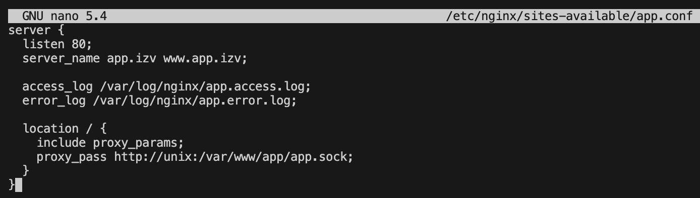

He creado el enlace simbólico del archivo de sitios webs

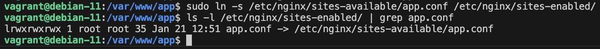

He comprobado que la configuración de nginx esta correcta

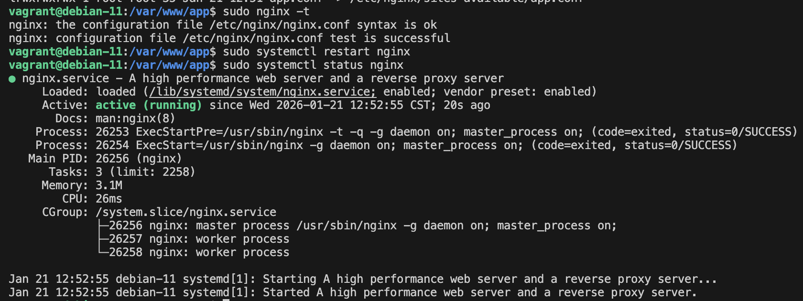

He modificado el fichero /etc/hosts de mi máquina anfitriona

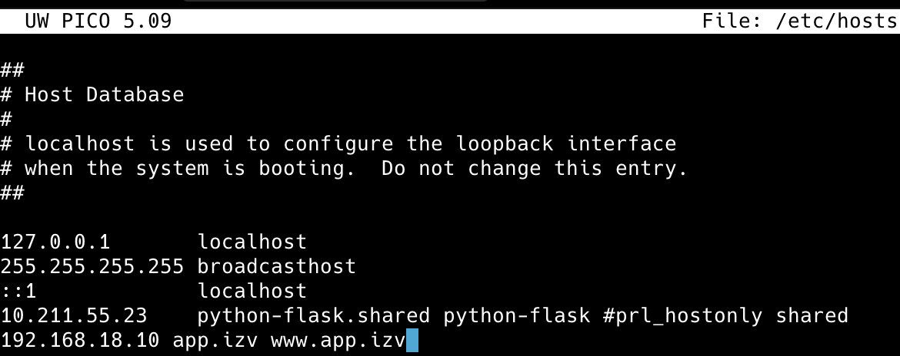

Y he comprobado que funciona 

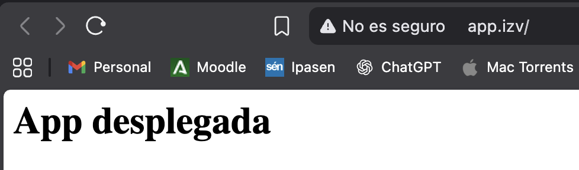

## Tarea de ampliación

Para la tarea de ampliación he partido de la máquina Vagrant como la tenía antes, y he empezado igual que antes

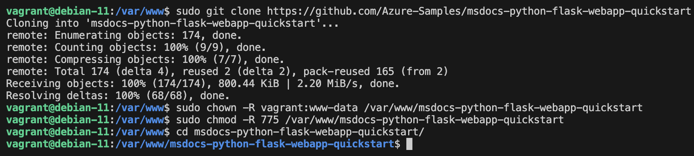

He creado el fichero .env con esta configuración 

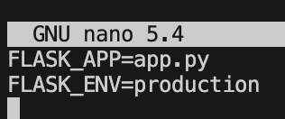

He creado y activado el entorno virtual

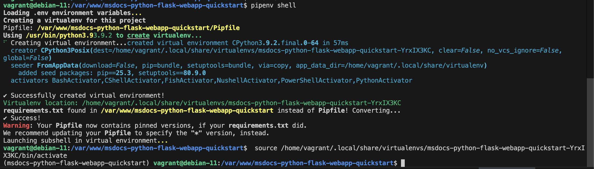

He instalado las dependencias del proyecto

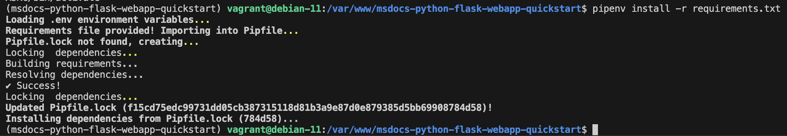

He probado la aplicación con Flask

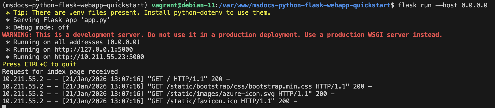

He probado que funciona con gunicorn

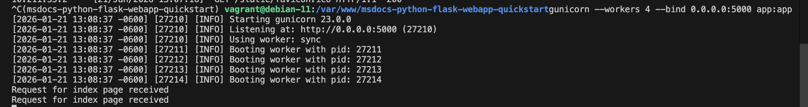

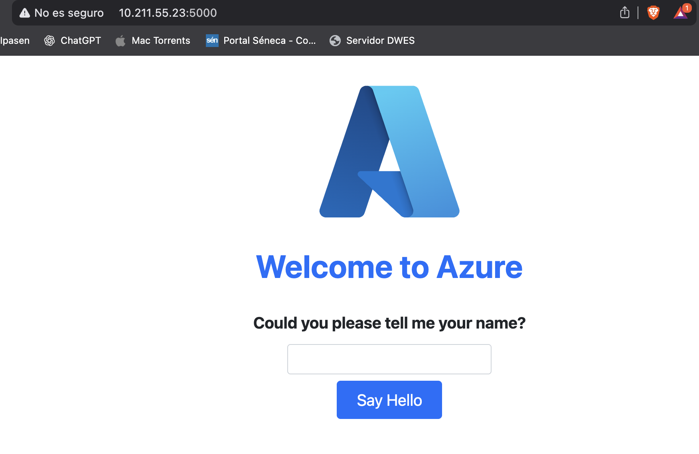

He comprobado cual es la ruta del proyecto con gunicorn

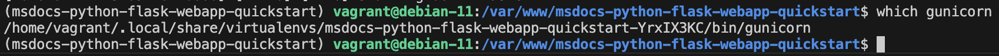

He creado el servicio systemd para hacer
